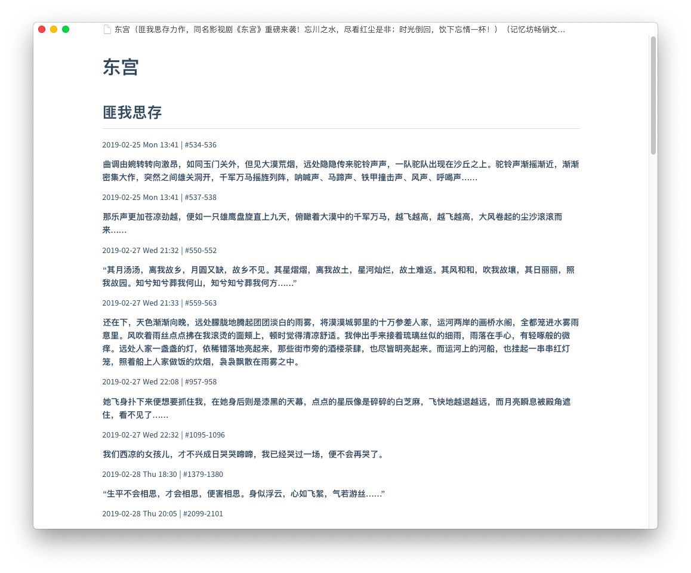

# oh-my-kindle-clipping

## 偷代码之后为了Obsidian所作的小小修改

1. 将作者的格式从二级标题改为加粗
2. 为了和个人的monthly note链接，将日期格式改成了`[[2021-10]]`
3. 在没有确切page而只有“#”位置的情况下，在“#”后加了一个空格，避免被Obsidian识别为标签
4. 把正文从**加粗**改成了引用`> `
5. 在文档最后加入了“#MyClippings”的标签，以方便在网络视图中将相关文档连接到一个节点
6. 初次运行有如下一个报错，胡乱指定了两次（？）utf8<br>
`UnicodeEncodeError: 'gbk' codec can't encode character '\xc0' in position 216: illegal multibyte sequence`
7. 原作者🐂🍺

### 网络Demo（Obsidian）


### 需要搞

- [ ] 第一次没标全第二次重复标记会有两条记录,根据字符串start with的关系和位置/页码去重

## Demo




## 使用

```bash
> cd oh-my-kindle-clipping
> python3 run.py "My Clippings.txt"
```

